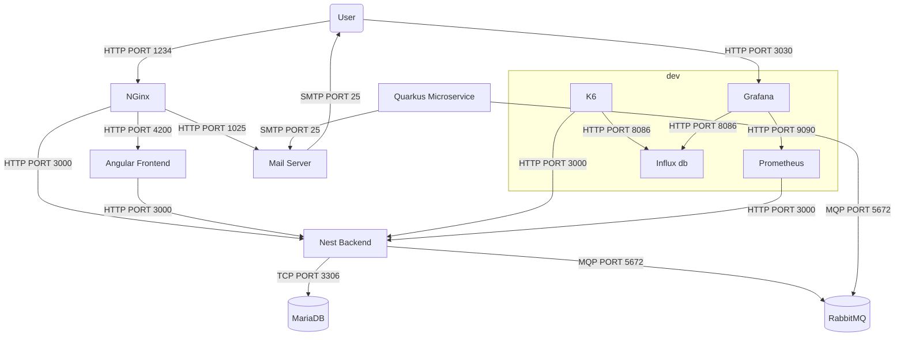

# Architecture de l'application - Projet fini

## Schéma de nos micro-services

## Explications de notre architecture

Le back-end de l'application est géré par un service NestJS, qui communique avec une base de données MariaDB pour stocker les données, et utilise une file d'attente de messages AMQP pour envoyer des messages de manière asynchrone.

Le frontend et le backend sont des services distincts, permettant une séparation claire des responsabilités entre l'interface utilisateur et la logique métier. NGinx est utilisé pour servir le frontend et agir comme proxy inverse pour le backend.

Le microservice Quarkus consomme des messages provenant d'une file d'attente AMQP et envoie des courriels en utilisant le protocole SMTP.

Le système inclut rabbitmq comme file d'attente de messages, ce qui permet au service NestJS d'envoyer des messages de manière asynchrone au microservice microservice Quarkus.

## Choix des technologies

- Utilisation de NestJS pour le service backend : NestJS est un framework populaire et puissant pour construire des applications côté serveur évolutives et maintenables en utilisant Node.js. Nest fournit un ensemble puissant d'outils et de fonctionnalités tels que le support intégré de TypeScript, l'architecture modulaire et les décorateurs, ce qui en fait un bon choix pour construire un backend important et complexe.

- Utilisation de MariaDB pour la base de données : MariaDB est un système de gestion de base de données relationnelles open source compatible avec MySQL. C'est un outil performant qui bénéficie d'une communauté active.

- Utilisation de RabbitMQ pour la messagerie : RabbitMQ est un système de mise en file d'attente de messages populaire et très performant qui permet d'envoyer et de recevoir des messages de manière asynchrone. Cela permet au service dorsal de se décharger d'une partie de sa charge de travail et d'améliorer l'évolutivité et la réactivité.

- Utilisation de Nginx comme proxy inverse et équilibreur de charge : Nginx est un serveur web et un proxy inverse léger et performant. Il est connu pour sa faible consommation de ressources et sa capacité à gérer de grandes quantités de connexions simultanées, ce qui le rend bien adapté à une utilisation en tant que proxy inverse et équilibreur de charge dans une architecture microservices.

## Alternatives possibles

Au lieu d'utiliser NestJS, nous aurions pu choisir un autre framework web, comme Express.js pour Node.js ou Flask pour Python.

Si on n'a pas besoin de la complexité d'une file d'attente de messages AMQP, nous aurions pu utiliser une solution de messagerie plus simple, telle que Kafka.

Nous aurions pu utiliser un autre langage pour le backend, comme Go ou Java.

Nous aurions pu décomposer le backend en éléments plus petits, comme un service distinct pour l'authentification, ou un service distinct pour les utilisateurs, les associations, etc. pour les utilisateurs, les associations, etc. Cependant, nous avons décidé de rester simples et d'utiliser un seul service de backend pour tous.

## Liste des services implémentés dans ce projet

- Frontend Angular
- Backend NestJS
- Microservice Quarkus
- RabbitMQ
- MariaDB
- Serveur de messagerie
- NGinx
- Prometheus
- Grafana
- InfluxDB
- K6

## Statuts des différents services implémentés

| Service           | Status                             |
| ----------------- | ---------------------------------- |
| Backend NestJS    | Implementé, Monitoré et Load testé |
| Frontend Angular  | Implementé                         |
| MariaDB           | Implementé                         |
| RabbitMQ          | Implementé                         |
| Nginx             | Implementé                         |
| Quarkus           | Implementé                         |
| Server messagerie | Implementé                         |
| Prometheus        | Implementé                         |
| Grafana           | Implementé                         |
| InfluxDB          | Implementé                         |
| K6                | Implementé                         |

## Options de configuration

### Backend config :

| Name                  | Value                          | Example        | Required |
| --------------------- | ------------------------------ | -------------- | -------- |
| `MYSQL_ROOT_PASSWORD` | Le mot de passe root de la bdd | example        | ✅       |
| `MYSQL_USERNAME`      | Le nom d'utilisateur de la bdd | user           | ✅       |
| `MYSQL_PASSWORD`      | Le mot de passe de la bdd      | example        | ✅       |
| `MYSQL_DATABASE`      | Le nom de la bdd               | administration | ✅       |

### Quarkus config :

| Name                    | Value                                           | Example  | Required |
| ----------------------- | ----------------------------------------------- | -------- | -------- |
| `RABBITMQ_DEFAULT_USER` | Le nom d'utilisateur de l'instance de RabbitMQ. | admin    | ✅       |
| `RABBITMQ_DEFAULT_PASS` | Le mot de passe de l'instance de RabbitMQ.      | admin    | ✅       |
| `RABBITMQ_HOST`         | L'adresse de l'instance de RabbitMQ.            | rabbitmq | ✅       |
| `RABBITMQ_PORT`         | Le port de l'instance de RabbitMQ.              | 5672     | ✅       |

## Comment utiliser l'application

L'application est accesible sur le port `1234`

Le service de mail est disponible sur l'endpoint `/mail/`

L'api est disponible sur l'endpoint `/api/api`

Le dashboard grafana est disponible sur le port `3030`

### En mode développement

Lancer l'application: `npm run start:dev`

Arreter l'application: `npm run stop:dev`

Lancer le test de charge: `npm run loadtest`

### En mode production

Lancer l'application: `npm run start:prod`

Arreter l'application: `npm run stop:dev`

## Mesures de sécurité

Les services exposent uniquement les ports nécessaires à l'extérieur. Par exemple, NGinx expose le port 1234, mais les services internes communiquent via un réseau Docker interne (`back`).

Les seuls ports exposés en prod sont les ports 1234 et 3030 de NGINX et de Grafana.

## Fonctionnalités supplémentaires

## Post-Mortem
