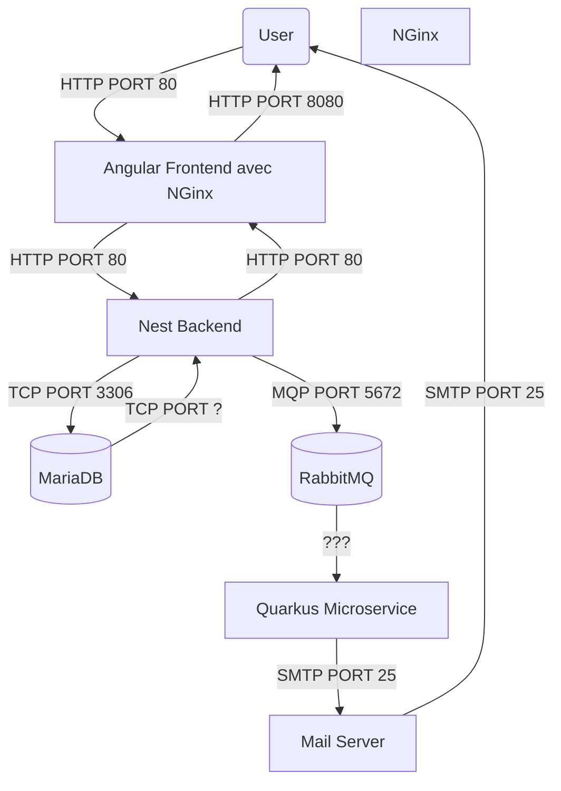

# Architecture de l'application - Projet en cours

```mermaid

flowchart TB

  U(User)
  D[(MariaDB)]
  F[Angular Frontend avec NGinx]
  B[Nest Backend]
  N[NGinx]
  M[(RabbitMQ)]
  Q[Quarkus Microservice]
  Ml[Mail Server]

  U -->|HTTP PORT 80| F
  F -->|HTTP PORT 8080| U

  F -->|HTTP PORT 80| B
  B -->|HTTP PORT 80| F

  B -->|TCP PORT 3306| D
  D -->|TCP PORT ?| B

  B -->|MQP PORT 5672| M

  M -->| ??? | Q

  Q -->|SMTP PORT 25| Ml

  Ml -->|SMTP PORT 25| U

```
